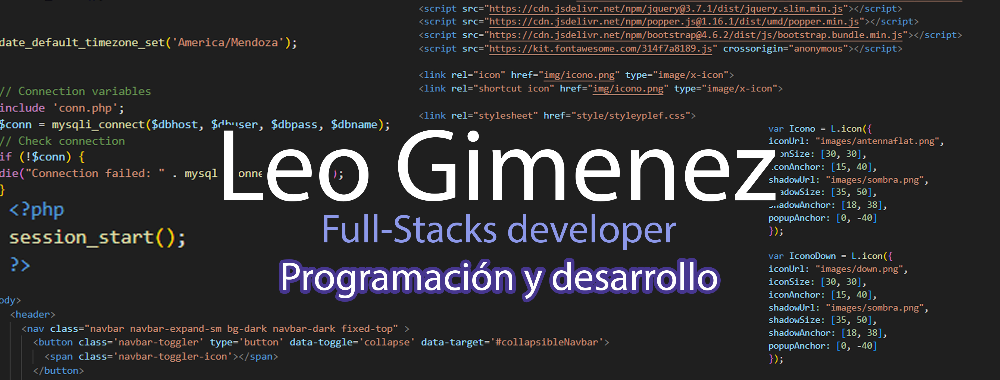
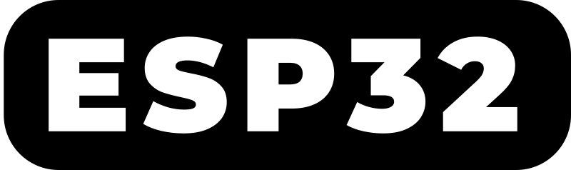

### Desarrollador Full Stack

<h2>Hola, soy Leo Gimenez 👋 </h2>

<!--
**LeoGidev/LeoGidev** is a ✨ _special_ ✨ repository because its `README.md` (this file) appears on your GitHub profile.

Here are some ideas to get you started:

- 🔭 I’m currently working on ...
- 🌱 I’m currently learning ...
- 👯 I’m looking to collaborate on ...
- 🤔 I’m looking for help with ...
- 💬 Ask me about ...
- 📫 How to reach me: ...
- 😄 Pronouns: ...
- ⚡ Fun fact: ...
-->

Actualmente, me encuentro completamente enfocado en el desarrollo de aplicaciones utilizando diversas tecnologías de vanguardia. 
                      Durante siete años, tuve el privilegio de trabajar para una destacada empresa de internet, donde ascendí hasta el puesto de Supervisor en el Área de
                       Desarrollo de Tecnologías Electrónicas. Durante este periodo, tuve la oportunidad de participar activamente en una amplia variedad de proyectos. Estos 
                       abarcaron desde programación web avanzada hasta desarrollos innovadores en el ámbito de IoT (Internet de las Cosas) y automatización de procesos.
                        Con una sólida experiencia adquirida, he tomado la decisión de sumergirme por completo en este fascinante campo laboral.
                        

 Mi pasión por la tecnología y el desarrollo de soluciones innovadoras me impulsa a buscar constantemente nuevos desafíos 
                         y oportunidades para crecer profesionalmente."

<h3>Tecnologías:</h3>
<table>
<tr>
  <td>Python </td>
  <td>PHP </td>
  <td>HTML </td>
  </tr>
 <tr>
  <td>CSS </td>
  <td>Java Script </td>

  <td>MySql </td>
  </tr>
 <tr>
  <td>Git </td>
  <td>Git Hub </td>
  <td>Arduino </td>
  
 </tr>
<tr>
  <td>Esp32 </td>
<td>Selenium </td>
<td>C++ </td>
  
 </tr>
</table>

Dia a día me capacito en nuevas tecnologías y tengo interés en en los siguientes campos:

<table><tr><td>Laravel</td><td>Vue-js</td><td>React</td><td>Ruby</td><td>Kotlin</td><td>Angular</td>
</tr></table>

Las cuales iré incorporando y subiré a esta cuenta cada proyecto de práctica

